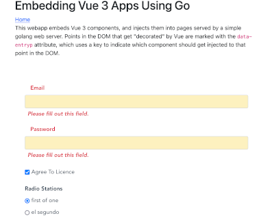

# Getting Go Webapps to Integrate Vue 3 Components

This repo is an experiment in getting a Go based web server to load and
integrate Vue 3 components.

I've been playing with this idea for a while: trying to figure out how
the Vue build system works so I can get Go to expose the correct components
via Golang handlers, renderers, and templates. I did not get this to
work with the old Vue 3 build system, but since [Evan You of Vue.js fame](https://en.wikipedia.org/wiki/Vue.js#History) decided
to write himself the new [Vite build system](https://vitejs.dev/) and loader, I thought it might
be a good time to try this again.

The actual vue glue code has been separated into a go module. It's marked as "pre-release" because it is: the code is
proof of concept, may not be safe, may eat your dog or other family
members. But it works with the test program in this repo. See it
[here](https://github.com/torenware/vite-go).

This test build does the following:

* It demonstrates a simple Go-based web server with a couple of pages implemented.

* It has code that analyzes a Vite-based dist/ directory, and uses Go 1.16 embedding to probe the Vite based assets. There's a bit of template logic to decorate the Go page adding the link, script and style sections to serve the Vite assets with the generated page.

* It includes a Makefile and vite.config.ts file that rebuilds the Vue 3 app as needed, and runs go via `go run`.

* It integrates a Vue 3 app as a non-trivial demo of a webform with client side validation.

Much obliged to Máximo Mussini (@maximomussini on Twitter), rubist and Vite expert, for his help. I now understand, more or less, how Vite configuration works and how to integrate Vue into frameworks like Rails.  This demo uses an approach inspired by Vite Ruby, a library Máximo wrote.

--Rob Thorne

Copyright © 2022 Rob Thorne

[MIT License](https://github.com/torenware/go-tooling-for-vue/blob/8999977a5bffb8f0630740220c576b550a7115e9/LICENSE.md)

## Vue 3 + Typescript + Vite

This template should help get you started developing with Vue 3 and Typescript in Vite. The template uses Vue 3 `<script setup>` SFCs, check out the [script setup docs](https://v3.vuejs.org/api/sfc-script-setup.html#sfc-script-setup) to learn more.

### Recommended IDE Setup

* [VSCode](https://code.visualstudio.com/) + [Volar](https://marketplace.visualstudio.com/items?itemName=johnsoncodehk.volar)

### Type Support For `.vue` Imports in TS

Since TypeScript cannot handle type information for `.vue` imports, they are shimmed to be a generic Vue component type by default. In most cases this is fine if you don't really care about component prop types outside of templates. However, if you wish to get actual prop types in `.vue` imports (for example to get props validation when using manual `h(...)` calls), you can enable Volar's `.vue` type support plugin by running `Volar: Switch TS Plugin on/off` from VSCode command palette.
